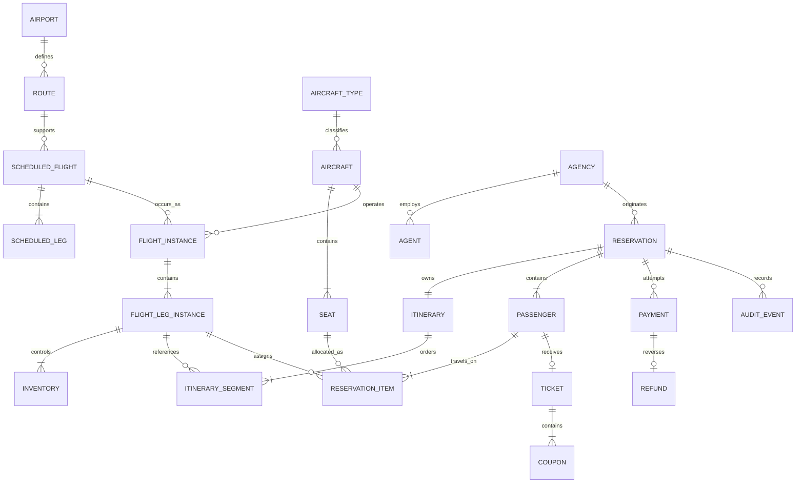
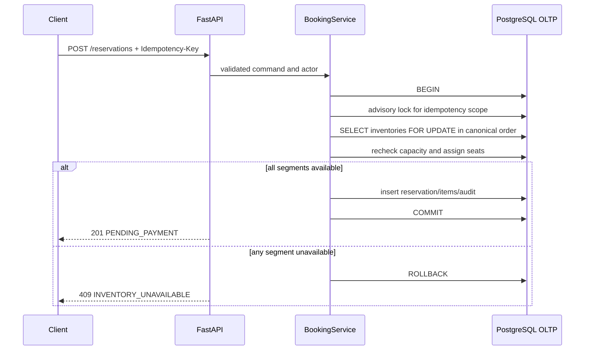
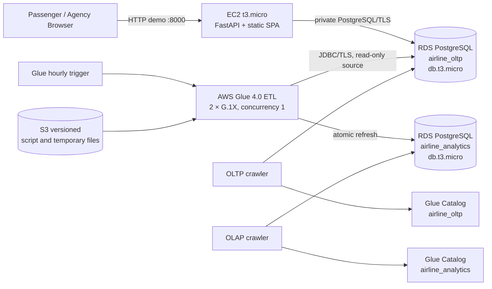

# Airline Reservation System

## Big Data and Data Engineering Midterm — Final Report

**Student:** Santiago Garzon  
**Submission language:** English  
**Region:** `us-east-1`  
**Environment:** AWS Academy Learner Lab  
**Assessment date:** September 10, 2026  
**Source revision:** local `main`; the final GitHub URL and release commit must be added before submission

---

## Executive summary

This project implements a small regional-airline reservation system and its
first analytical data platform. The transactional application supports direct
and one-connection searches, multi-passenger reservations, temporary seat
holds, automatic seat assignment, simulated payments, ticket issuance,
cancellation, refunds, agency attribution, manifests, and an auditable state
history. PostgreSQL row locking and database constraints prevent overselling
under concurrent requests.

The application is deployed on AWS using a small EC2 instance and a private
Amazon RDS PostgreSQL OLTP database. A second private RDS PostgreSQL instance
contains a dimensional OLAP model. An hourly AWS Glue 4.0 Spark job connects to
both databases through private JDBC connections, refreshes analytical facts and
dimensions, and records reconciliation results. Two Glue crawlers publish 12
selected OLTP tables and 13 OLAP tables in separate Glue Data Catalog
databases.

The current list-price run rate is approximately **USD 67.41 per month** before
Academy credits and taxes. Changing the refresh frequency from hourly to daily
would reduce it to approximately **USD 44.99 per month** without changing the
data model.

## 1. Context, scope, and assumptions

### 1.1 Business context

The system serves a small regional airline that sells directly and through
partner travel agencies. Commercial management needs a reliable transactional
system now and data prepared for later analysis of occupancy by route, revenue
by fare, and cancellation patterns.

The team did **not receive an additional team-specific business or technical
constraint** under section 3 of the assignment. The principal environmental
constraint is AWS Academy Learner Lab: IAM creation or modification is
prohibited by project policy, only allowed regions/services may be used, and
the available budget is limited.

### 1.2 Explicit sizing assumptions

| Assumption | Adopted value |
|---|---|
| Airline size | 8 airports, 12 direct routes, 4 aircraft |
| Operations | 24 flight instances/day |
| Demand | 500 passengers and 250 reservations/day |
| Seasonal peak | 5× normal searches and 3× normal reservation creation |
| Search horizon | Current time through 180 days |
| Sales cutoff | 60 minutes before first-segment departure |
| Itinerary | One-way; direct or one connection; maximum 2 segments |
| Connection | Same airport, 45 minutes to 6 hours |
| Party size | 1–9 passengers, same itinerary and cabin |
| Cabins | Economy and Business |
| Currency | COP only; AWS infrastructure costs are stated in USD |
| Hold | 60 minutes pending payment |
| Quote validity | 15 minutes |
| Cancellation | Whole reservation until 24 hours before departure |
| Refund | 90% of approved amount; 10% academic penalty |
| Agency commission | 5% of fare before tax; passenger price unchanged |
| Payment | Simulated; no PAN, CVV, or real payment provider |
| Demonstration data | Synthetic only |

### 1.3 Scope exclusions

Round trips in one reservation, more than one connection, partial
cancellations, itinerary changes, check-in, visual seat selection, baggage,
meals, loyalty, promotional coupons, codeshare, notifications, real payments,
multiple currencies, passenger age categories, and production authentication
are outside the MVP. A return journey can be represented by a second one-way
reservation. Flight coupons associated with issued tickets remain in scope.

## 2. Functional requirements

Priorities use MoSCoW. All requirements are approved as the final baseline for
this implementation.

| ID | Requirement | Actor | Priority |
|---|---|---|---|
| FR-001 | Search one-way itineraries by origin, destination, local date, passenger count, and cabin. | Passenger, agency agent | Must |
| FR-002 | Return direct itineraries and itineraries with at most one connection. | Passenger, agency agent | Must |
| FR-003 | Enforce contiguous segments and a same-airport connection of 45 minutes to 6 hours. | System | Must |
| FR-004 | Show schedules, local zones, cabin, minimum availability, total quote, and expiration. | Passenger, agency agent | Must |
| FR-005 | Exclude expired holds from effective availability. | System | Must |
| FR-006 | Reject reservations outside 180 days or inside the 60-minute sales cutoff. | Passenger, agency agent | Must |
| FR-007 | Create one reservation for one itinerary and 1–9 passengers. | Passenger, agency agent | Must |
| FR-008 | Hold every passenger/segment atomically or hold nothing. | System | Must |
| FR-009 | Prevent negative inventory and duplicate active seat assignment on a flight leg. | System | Must |
| FR-010 | Lock inventory rows in canonical order and recheck availability within the transaction. | System | Must |
| FR-011 | Make reservation creation idempotent by actor, channel, and key for 24 hours. | Passenger, agency agent | Must |
| FR-012 | Create a 60-minute `PENDING_PAYMENT` hold. | System | Must |
| FR-013 | Assign one valid physical seat per passenger and segment automatically. | System | Must |
| FR-014 | Expire unpaid reservations and release resources exactly once. | System | Must |
| FR-015 | Retrieve a guest reservation using locator and passenger surname. | Passenger, agency agent | Must |
| FR-016 | Record simulated payment attempts without cardholder data. | Payment simulator | Must |
| FR-017 | Atomically confirm reservation and seats after timely approval. | Payment simulator | Must |
| FR-018 | Issue one ticket per passenger and one coupon per itinerary segment. | System | Must |
| FR-019 | Mark a declined reservation `PAYMENT_FAILED` and release resources once. | Payment simulator | Must |
| FR-020 | Reject payment approval after hold expiration. | Payment simulator | Must |
| FR-021 | Make payment processing idempotent by operation reference. | Payment simulator | Must |
| FR-022 | Cancel a confirmed reservation until 24 hours before departure, void documents, release inventory, and record the refund. | Passenger, agency agent | Must |
| FR-023 | Cancel a pending reservation without ticket or refund creation. | Passenger, agency agent | Must |
| FR-024 | Make cancellation idempotent and preserve commercial history. | System | Must |
| FR-025 | Reject partial cancellation and flight/date changes as unsupported. | Passenger, agency agent | Must |
| FR-026 | Use the same inventory rules for agencies while recording agency and agent attribution. | Agency agent | Must |
| FR-027 | Calculate a 5% agency commission before tax without changing passenger total. | System | Should |
| FR-028 | Maintain airport, aircraft, seat, route, schedule, flight-instance, inventory, and fare catalogs. | Administrator | Must |
| FR-029 | Enforce valid flight-instance state transitions. | Administrator | Should |
| FR-030 | Reject aircraft substitution that cannot preserve active capacity and seat assignments. | Administrator | Must |
| FR-031 | Return a read-only confirmed-passenger manifest without payment details. | Airport staff | Should |
| FR-032 | Calculate price by route/cabin base, advance band, airport fee, and simulated tax. | System | Must |
| FR-033 | Store and calculate COP amounts as fixed decimals with half-up two-decimal rounding. | System | Must |
| FR-034 | Preserve an immutable price breakdown per passenger and segment. | System | Must |
| FR-035 | Audit reservation, payment, ticket, and inventory state transitions with actor, time, reason, old/new state, and correlation ID. | System | Must |
| FR-036 | Load approved revenue, refunds, cancellations, and occupancy snapshots into PostgreSQL OLAP. | ETL process | Must |
| FR-037 | Distinguish voluntary cancellation from expiration and payment failure analytically. | ETL process, analyst | Must |
| FR-038 | Prepare gross/net revenue, cancellation, and confirmed occupancy facts by relevant dimensions. | Analyst | Must |
| FR-039 | Execute the analytical ETL automatically every hour using an activated Glue trigger. | ETL process | Must |
| FR-040 | Publish selected OLTP and OLAP metadata in separate Glue Catalog databases. | ETL process, analyst | Must |

The detailed acceptance criteria and origins are preserved in
[`docs/02-functional-requirements.md`](docs/02-functional-requirements.md).

## 3. Non-functional requirements

Each NFR defines a measurable condition and the business risk that motivates
it. Production targets are distinct from what a low-cost Learner Lab can prove.

| ID | Category | Verifiable target | Business risk and architectural consequence |
|---|---|---|---|
| NFR-01 | Performance | At the assumed baseline dataset, flight search must achieve p95 ≤ 800 ms for direct results and p95 ≤ 1.5 s with one connection under 50 concurrent search clients. Reservation creation/query must achieve p95 ≤ 1.0 s, excluding external payment time. | Slow search loses sales. Indexed relational searches and a thin API are used; future load testing must report p50/p95/p99. |
| NFR-02 | Consistency/concurrency | With one remaining seat and 20 simultaneous independent PostgreSQL sessions, exactly one reservation succeeds, 19 receive `INVENTORY_UNAVAILABLE`, availability ends at zero, and no partial or duplicate seat assignment exists. Repeat 30 times for direct and two-segment bottlenecks. | Overselling creates operational and regulatory harm. PostgreSQL pessimistic locking, canonical lock order, atomic transactions, and constraints are mandatory. |
| NFR-03 | Availability | Production target: 99.9% monthly availability for search and reservation APIs, excluding announced maintenance (≤43.8 minutes/month). Learner Lab is a Single-AZ demonstration and does not claim this SLA. | Peak downtime loses revenue. A production design would require Multi-AZ RDS, at least two API instances, health-checked load balancing, and automated recovery; these are excluded here for cost. |
| NFR-04 | Recovery | Production OLTP RPO ≤ 5 minutes and RTO ≤ 60 minutes; OLAP RPO ≤ 1 hour and RTO ≤ 4 hours. Lab backups retain one day and teardown requires export/snapshot according to the runbook. | Reservation loss is more severe than rebuilding analytics. OLTP receives stricter recovery objectives; OLAP is reproducible from OLTP. |
| NFR-05 | Security/privacy | RDS must remain private and encrypted; JDBC must require TLS; secrets must be absent from Git/logs; queries must be parameterized; API validation must reject malformed input; no PAN/CVV is stored; analytical tables must exclude direct passenger PII. | Passenger/payment exposure causes legal and reputational harm. Synthetic data is used. For the exercise, Colombian Law 1581/2012 principles guide PII minimization; PCI DSS scope is avoided by not processing cards. |
| NFR-06 | Scalability | The system must support 20 additional routes/year and the declared 5× search/3× booking peak without changing the domain model. Before 10× volume/frequency, search indexes and DB load are measured and full-snapshot ETL is replaced by auditable incremental staging/merge. | Database contention and full scans are the first likely bottlenecks. Stateless API scaling and isolated OLAP protect the transaction path. |
| NFR-07 | Auditability | Every commercial state transition must be reconstructable by entity/correlation ID with actor, UTC time, reason, old/new state, and immutable financial snapshots. Academic evidence is retained for the course; a production retention period of five years is assumed pending legal policy. | Disputes and reconciliation require more than application logs. Audit rows and historical commercial records are not physically deleted. |
| NFR-08 | Maintainability | Domain/application automated coverage must remain ≥90%; Ruff and strict mypy must pass; Alembic is the sole DDL authority; a clean PostgreSQL database must migrate from base to head reproducibly. | Divergent schemas and untested rules cause defects. CI-quality gates and versioned migrations enforce consistency. |
| NFR-09 | Observability | Health endpoint, correlation IDs, sanitized errors, Glue run status/DPU seconds, ETL row counts and monetary deltas must be observable. A failed job or refresh older than 2 hours must raise an operational alert in production. | Silent pipeline failure produces stale or incorrect business data. Glue and `analytics.etl_run` provide independent evidence. |
| NFR-10 | Analytical freshness | The Glue trigger runs at minute 0 every hour; each successful run records `source_cutoff_at`. | Commercial users need bounded staleness. Hourly freshness is balanced against Glue cost. |
| NFR-11 | Analytical consistency | OLTP is read using `REPEATABLE READ`; all facts publish in one OLAP transaction; approved-payment and refund reconciliation deltas must be exactly COP 0.00. | Partial or mixed-cutoff facts lead to incorrect revenue. Atomic publication and reconciliation fail the run safely. |
| NFR-12 | Analytical isolation/idempotency | ETL has concurrency 1, never writes OLTP, and rerunning the same `run_id`/snapshot cannot duplicate facts. | Analytics must not degrade or corrupt the booking system. Separate RDS instances and transaction-scoped foreign tables enforce the boundary. |

## 4. Entity-relationship model

### 4.1 Modeling decisions

The model uses **Crow's Foot notation** and is normalized for transactional
integrity. A recurring `ScheduledFlight` contains ordered `ScheduledLeg`
records; a dated `FlightInstance` contains operational
`FlightLegInstance` records. A reservation owns one ordered itinerary and may
contain multiple passengers. `ReservationItem` is the passenger × segment
intersection and stores the immutable fare and active/historical seat state.

Authoritative inventory is one row per flight-leg instance and cabin. It stores
capacity, held, and confirmed counts, constrained by
`capacity >= held + confirmed`. Booking locks all required inventory rows in a
canonical order. A partial unique PostgreSQL index prevents two active
assignments of the same physical seat on the same leg while allowing historical
released assignments.



Editable source: [`diagramas/airline-oltp-erd.drawio`](diagramas/airline-oltp-erd.drawio).

### 4.2 Brief data dictionary

| Entity | Key information and purpose |
|---|---|
| `airports` | IATA code PK, name, IANA time zone; public airport catalog. |
| `cabins` | Cabin code PK, order, active flag. |
| `aircraft_types` | Type identifier and cabin capacities. |
| `aircraft` | Tail/equipment instance referencing an aircraft type. |
| `seats` | Physical aircraft seat; unique label per aircraft and assigned cabin. |
| `routes` | Directed origin/destination airport pair and base commercial context. |
| `scheduled_flights` | Recurring commercial flight number and schedule. |
| `scheduled_legs` | Ordered legs of a recurring flight with local schedule and base fare. |
| `flight_instances` | Dated execution of a scheduled flight, aircraft, and operational state. |
| `flight_leg_instances` | Ordered dated leg with UTC departure/arrival and sellable state. |
| `inventories` | Authoritative capacity, held, and confirmed counts per leg/cabin. |
| `reservations` | Locator, state, channel/actor, hold expiry, total, commission, idempotency snapshot. |
| `passengers` | Synthetic given name and surname belonging to a reservation. |
| `itineraries` | One-to-one reservation itinerary container. |
| `itinerary_segments` | Ordered itinerary segments referencing flight-leg instances. |
| `reservation_items` | Passenger-segment seat assignment and immutable fare/tax/fee snapshot. |
| `payments` | Simulated attempt, COP amount, state, and unique operation reference; no card data. |
| `refunds` | Simulated refund linked to the approved payment. |
| `tickets` | Immutable ticket number/state per confirmed passenger. |
| `coupons` | One ticket coupon per passenger segment. |
| `audit_events` | Actor, correlation, entity, reason, previous/new state, UTC timestamp. |
| `agencies` / `agents` | Active partner agency and its authorized agent identities. |
| `demo_identities` | Controlled role fixtures for non-production authorization demonstrations. |
| `fare_rules` | Versioned pricing multipliers and fixed fare policy. |
| `operational_settings` | Hold, quote, sales, cancellation, tax, and refund policy values. |
| `idempotency_records` | Authoritative key scope, payload hash, response reference, and expiry. |

Full column-level definitions are in
[`docs/data-dictionary.md`](docs/data-dictionary.md). Alembic migrations are
the authoritative physical schema.

## 5. Backend architecture

### 5.1 Decision

The backend is a **modular monolith** implemented with FastAPI, SQLAlchemy,
and PostgreSQL. Search, reservation, payment, ticketing, cancellation, audit,
administration, and manifests share one deployable process but remain separated
into API, application, domain, and persistence modules.

Microservices were rejected for the MVP because seat inventory, reservation,
payment, and ticket effects require a single strong transaction. Splitting them
would introduce distributed transactions, compensation, duplicate policy, and
additional Academy cost without satisfying a present scale requirement.

### 5.2 Concurrency and transaction design



This implements NFR-02 and FR-008–011. Canonical `(leg, cabin)` lock order
reduces deadlock risk. Database `CHECK`, `UNIQUE`, foreign-key, and partial
unique constraints provide a second line of defense.

### 5.3 Payment and agency exposure

Payment is simulated through the same backend; it accepts only an approval
boolean and synthetic operation reference. Approval, reservation confirmation,
inventory transition, ticket/coupon issuance, and audit occur atomically. The
same versioned `/api/v1` serves direct and agency channels because inventory
rules are identical. Agency/agent attribution and authorization are explicit,
avoiding duplicated booking logic. A future B2B gateway could expose the same
application service with production authentication and rate limits.

### 5.4 Relationship to analytics

The API receives only OLTP credentials and never queries OLAP. Glue extracts a
consistent OLTP snapshot and loads the separate analytical RDS. Analytical
failure therefore does not block booking, satisfying NFR-12.

## 6. Frontend architecture

The frontend is a dependency-free, static single-page client using HTML, CSS,
and JavaScript, served same-origin by FastAPI. This minimizes build/runtime
complexity and network round trips for the academic MVP while supporting the
search-to-cancellation workflow.

It implements direct and agency modes in one interface because both consume
the same domain rules. Runtime data is never mocked. If availability changes
between search and booking, the API returns a structured `409
INVENTORY_UNAVAILABLE`; the UI shows the conflict and requires a fresh search.
This is request/response feedback rather than WebSocket push, appropriate to
the MVP and consistent with database-authoritative availability.

The interface supports English labels and COP only. Internationalization and
multiple currencies are explicit future extensions: presentation strings and
currency formatting would be separated from the API's immutable COP amounts;
exchange-rate conversion would never alter stored transaction values.

The browser client consumes:

- `GET /api/v1/flights/search`;
- `POST /api/v1/reservations`;
- `GET /api/v1/reservations/{locator}`;
- `POST /api/v1/reservations/{id}/payments`;
- `POST /api/v1/reservations/{id}/cancel`;
- `GET /api/v1/reservations/{id}/tickets`.

## 7. First backend implementation

### 7.1 Implemented critical operations

FastAPI exposes the required search, reservation creation, and reservation
query operations plus payment, cancellation, tickets, manifests, health, and
controlled administration. PostgreSQL implements the complete ER model and is
managed exclusively with Alembic migrations `0001` through `0008`.

### 7.2 Concrete concurrency proof

The real PostgreSQL concurrency suite exercises two parametrized cases:

- direct itinerary with one remaining seat;
- two-segment itinerary whose second segment is the bottleneck.

Each case runs 30 iterations of 20 independent concurrent database sessions:
1,200 reservation attempts in total. Every iteration asserts exactly one
winner, 19 `INVENTORY_UNAVAILABLE` conflicts, zero remaining availability, no
negative counter, no duplicate active seat, and no partial reservation.

Recorded evidence:

```text
AIRLINE_CONCURRENCY_ITERATIONS=30 python3 -m pytest -q -m concurrency
2 passed
```

Additional recorded quality evidence includes 19 unit/API tests, 21
non-concurrency PostgreSQL integration tests, four analytical scenarios, Ruff
success, strict mypy success, and ≥90% scoped domain/application coverage. A
fresh audit on September 10 also produced 23 passing unit/API/analytics tests,
27 passing frontend tests, and successful positive/negative infrastructure
validation.

### 7.3 Execution guide

Local PostgreSQL and application:

```bash
cd backend
docker compose up -d
python -m pip install -e '.[dev]'
alembic upgrade head
python -m airline_core.persistence.seed_cli --include-demo
uvicorn airline_core.main:app --host 0.0.0.0 --port 8000
```

Tests:

```bash
cd backend
python -m pytest -q
AIRLINE_CONCURRENCY_ITERATIONS=30 python -m pytest -q -m concurrency
cd ../frontend && node test.js
cd .. && ./infra/validate.sh && ./infra/validate-negative.sh
```

AWS deployment is performed with `deploy/create-stack.sh`,
`deploy/ec2-run.sh`, and `deploy/update-analytics-stack.sh`; secrets are entered
interactively or passed at runtime and are not versioned.

## 8. AWS analytical implementation

### 8.1 Deployed architecture



All resources are in `us-east-1`. EC2 is in a public subnet for the demo. Both
RDS databases are private, encrypted, Single-AZ, and placed in a two-subnet DB
subnet group. Glue uses private ENIs and security-group rules. An S3 gateway
endpoint avoids a permanent NAT Gateway. The editable detailed diagram is
[`diagramas/arquitectura-aws.drawio`](diagramas/arquitectura-aws.drawio).

### 8.2 Analytical model and ETL

The OLAP schema is dimensional rather than a copy of the normalized OLTP
schema. It contains:

- dimensions: date, route, flight, cabin, channel, agency, and fare band;
- facts: reservation, passenger-segment sales, and leg-occupancy snapshot;
- bridge: reservation-to-route;
- control: ETL run and watermark.

This grain supports occupancy by route/cabin, gross and net revenue by fare,
and cancellation patterns by route/date/channel/advance band. Direct passenger
PII, actor IDs, agent IDs, documents, and idempotency keys are excluded.

The Glue job is the orchestrator; the versioned PostgreSQL function
`analytics.refresh_warehouse(run_id, snapshot_at)` performs set-based
transformation. The job opens transaction-scoped `postgres_fdw` foreign tables
for 12 selected OLTP sources, calls the function in `REPEATABLE READ`, drops the
foreign server before commit, and records success/failure separately. A full
snapshot plus UPSERT captures late payment, cancellation, and refund changes;
a `created_at`-only bookmark would miss these updates.

### 8.3 AWS service justification

| Service/component | Alternative | Supporting requirement | Well-Architected justification |
|---|---|---|---|
| EC2 `t3.micro` API | Lambda/ECS | FR-001–035; NFR-01/08 | **Cost optimization:** small on-demand host. **Operational excellence:** Dockerized reproducible runtime. **Performance efficiency:** adequate measured CPU for MVP. |
| RDS PostgreSQL OLTP | PostgreSQL on EC2 | FR-007–035; NFR-02/04/05 | **Reliability:** managed backups and transactional durability. **Security:** private encrypted DB. **Operational excellence:** managed engine. |
| Separate RDS PostgreSQL OLAP | Shared schema or Redshift | FR-036–038; NFR-11/12 | **Reliability/performance:** analytics cannot contend for OLTP compute. **Cost:** minimum Single-AZ class instead of a warehouse. |
| Glue 4.0 Spark job | Lambda or EC2 cron | FR-036/039; NFR-10/12 | **Operational excellence:** managed scheduling and run history. **Performance:** set-based refresh. **Cost/sustainability:** two-worker minimum and disabled outside needed windows. |
| Glue trigger | cron on EC2 | FR-039; NFR-10 | **Reliability/operations:** declarative hourly schedule independent of API process. |
| Two JDBC connections/crawlers | Manual metadata | FR-040 | **Operational excellence:** reproducible schema discovery. **Reliability:** separate OLTP/OLAP catalogs. Crawlers run only after schema changes. |
| Glue Data Catalog | Handwritten data dictionary only | FR-040 | **Operational excellence:** centralized queryable metadata; usage is below free thresholds. |
| Versioned encrypted S3 bucket | Script stored on EC2 | FR-039; NFR-08/09 | **Reliability/security:** recoverable ETL artifact, blocked public access, encryption. |
| S3 gateway endpoint | NAT Gateway | NFR-05/12 | **Security/cost/sustainability:** private S3 access without NAT hourly/processing cost. |
| VPC/private subnets/security groups/TLS | Public RDS | NFR-05/12 | **Security:** least network exposure. **Reliability:** controlled connectivity. |
| Existing Academy `LabRole` | Dedicated least-privilege role | Academy constraint; FR-039/040 | **Operational excellence:** only viable lab integration. This is a documented **security exception**; production requires dedicated roles. |

### 8.4 Live evidence

Read-only verification on September 10, 2026 established:

- CloudFormation stack `airline-demo`: `UPDATE_COMPLETE`;
- EC2 API: running and `/api/v1/health` returned `status=ok`;
- OLTP and OLAP RDS: PostgreSQL 16.10, `db.t3.micro`, 20 GB gp3,
  encrypted, private, Single-AZ;
- Glue ETL: two successful executions; 79 s/159 DPU-s and 131 s/262
  DPU-s;
- trigger `airline-analytics-etl-hourly`: `ACTIVATED`, `cron(0 * * * ? *)`;
- crawlers: both `SUCCEEDED`;
- Catalog `airline_oltp`: 12 authorized source tables;
- Catalog `airline_analytics`: 13 dimensional/control tables;
- analytical load evidence: 1,406 rows extracted/loaded with
  `approved_delta=0.00` and `refund_delta=0.00`.

## 9. Monthly cost projection

### 9.1 Assumptions

Prices are public list prices for `us-east-1`, 730 hours/month, with no Academy
credits, Free Tier, taxes, extraordinary transfer, or human labor. Glue costs
USD 0.44/DPU-hour. The scheduled observed run consumed 262 DPU-seconds.
Crawlers use 2 DPU and have a 10-minute billing minimum. S3 and Catalog usage
remain negligible at current scale.

| Component | Calculation | USD/month |
|---|---:|---:|
| EC2 `t3.micro` | 730 × 0.0104 | 7.59 |
| Public IPv4 | 730 × 0.005 | 3.65 |
| EBS gp3, 8 GB | 8 × 0.08 | 0.64 |
| OLTP RDS compute | 730 × 0.018 | 13.14 |
| OLTP RDS gp3, 20 GB | 20 × 0.115 | 2.30 |
| **Transactional application** | | **27.32** |
| OLAP RDS compute | 730 × 0.018 | 13.14 |
| OLAP RDS gp3, 20 GB | 20 × 0.115 | 2.30 |
| Hourly Glue ETL | 730 × 262/3,600 × 0.44 | 23.38 |
| Two weekly crawlers | 4.33 × 2 × 2 × 10/60 × 0.44 | 1.27 |
| Catalog, S3, current logs | below free/negligible thresholds | <0.01 |
| **Incremental analytics** | | **40.09** |
| **Total run rate** | | **67.41** |

### 9.2 Growth and frequency scenarios

| Scenario | Assumption | Total/month | Architectural response |
|---|---|---:|---|
| Current | Hourly, 262 DPU-s/run | USD 67.41 | Measure at least 30 runs and retain hourly only if required. |
| Daily refresh | 30 runs/month | USD 44.99 | Best low-cost laboratory configuration; 24-hour freshness. |
| Every 4 hours | 183 runs/month | USD 49.89 | Middle ground between cost and freshness. |
| Five-minute hourly ETL | 2 DPU for 5 minutes/run | USD 97.57 | Optimize SQL and incremental extraction before scaling workers. |
| 10× ETL duration | 2,620 DPU-s/run | USD 277.82 | Replace full snapshots with auditable CDC/staging/merge; measure RDS and cross-AZ transfer. |
| 10× frequency | 7,300 equivalent current runs | approximately USD 277.82 | Do not micro-batch Spark at this scale; group changes or use an event/incremental design. |

The frequency and duration 10× cases have the same Glue compute multiplication
under this simplified model. Volume growth can additionally require larger RDS
classes/storage and increase cross-AZ transfer, so USD 277.82 is not an upper
bound. Sustainability and cost optimization both favor processing only changed
rows and disabling scheduled compute when no consumer needs fresh data.

## 10. Design-to-implementation deviations

| Initial idea or ambiguity | Final implementation | Reason and consequence |
|---|---|---|
| Analytical schema initially co-located with OLTP | Separate OLAP RDS and migration/bootstrap path | The assignment calls for a second analytical database and isolation prevents analytical contention. Cost increases by USD 15.44/month. |
| ETL transformation could live in Python/Spark | Glue orchestrates a versioned PostgreSQL set-based function | One transformation contract serves local and AWS execution, avoids unavailable Glue Python packages, and permits atomic reconciliation. |
| Simple reservation-column idempotency | Authoritative `idempotency_records` plus advisory lock; reservation fields remain audit snapshots | Correctly enforces the 24-hour scope and detects same-key/different-payload conflicts under concurrency. |
| Agency identifiers were plain attributes | Foreign keys to active agency/agent catalogs and controlled demo identities | Prevents forged or incoherent agency attribution. |
| Frontend UUID generation assumed secure context | Web Crypto UUID fallback for public HTTP demo | `crypto.randomUUID()` is commonly unavailable outside HTTPS; the fallback preserves idempotency in Academy demo access. |
| Public EC2 address could change | A manually associated project Elastic IP stabilizes the demo | Improves demonstrability but adds USD 3.65/month and exists outside the CloudFormation lifecycle. |
| Production-style least-privilege IAM | Existing broad `LabRole` | Academy forbids project IAM changes. This is not a production recommendation. |

## 11. Traceability summary

| Concern | Requirement | Design/implementation | Evidence |
|---|---|---|---|
| No overselling | FR-008–010; NFR-02 | canonical `FOR UPDATE`, constraints, atomic service | 20 clients × 30 repetitions for direct and multi-leg cases |
| Multi-leg consistency | FR-002/003/007/008 | itinerary/segments and all-or-nothing inventory | integration rollback and ticket tests |
| Safe retries | FR-011/021/024 | idempotency records, hashes, unique operation references | reservation/payment/cancellation replay tests |
| Revenue correctness | FR-032–038; NFR-11 | immutable price facts and reconciled warehouse refresh | zero COP approved/refund deltas |
| OLTP isolation | FR-036; NFR-12 | separate RDS, read-only extraction path | API remains healthy during/after analytical deployment |
| Metadata visibility | FR-040 | two connections, crawlers, Catalog databases | 12 OLTP and 13 OLAP live tables |
| Freshness | FR-039; NFR-10 | activated hourly Glue trigger | scheduled successful job run |
| Privacy | NFR-05 | private encrypted RDS, TLS, PII-free OLAP | IaC validation and schema contract tests |

## 12. Limitations and production evolution

This is an educational MVP, not a production airline platform. The demo uses
HTTP, a public EC2 port, static demonstration identities, Single-AZ resources,
a broad Academy role, one API host, no WAF/load balancer, and one-day backup
retention. The EC2 root volume is currently unencrypted. These choices are
budget/environment compromises and cannot satisfy the stated production
availability and recovery targets.

A production evolution would introduce TLS termination and DNS, real identity
and role-based authorization, Secrets Manager, least-privilege IAM, Multi-AZ
RDS, multiple stateless API tasks behind a load balancer, WAF/rate limiting,
centralized metrics/alerts, tested point-in-time recovery, encrypted compute
volumes, data-retention governance, incremental change capture, and controlled
deployment pipelines.

## 13. Prompt log appendix

AI assistance was used as permitted by the assignment. The student reviewed
the resulting decisions and must be able to defend them. No credentials or
private access tokens are included.

| Stage | Main prompt intent | Refinement/correction by the team | Resulting artifact |
|---|---|---|---|
| Planning | Analyze the PDF, create a rigorous question set, account for Learner Lab IAM and USD 45 remaining budget. | The team confirmed no special constraint, one-person team, English submission, RDS preference, simple frontend, and a maximum USD 15 additional spend. | Project definition and Academy risk register. |
| Functional definition | Make requirements realistic for an airline while remaining defensible. | Scope was constrained to one-way/two-segment travel, synthetic payments, whole-reservation cancellation, COP, automated seats, and shared agency rules. | FR-001–040 and explicit exclusions. |
| Core engine | Build the reservation engine first with strong automated evidence. | PostgreSQL—not mocks/SQLite—was required for locking evidence; pricing/state/idempotency invariants were made testable. | Domain/application service and concurrency tests. |
| Database hardening | Make Alembic the only DDL authority and prove repeatable bootstrap/migrations. | Required catalogs were separated from synthetic demo fixtures; legacy migration and constraint tests were added. | Migrations, bootstrap, schema tests, data dictionary. |
| MVP completion | Add API, minimal frontend, deployment, and simulations without analytics yet. | Parallel work was integrated only after domain rules and PostgreSQL behavior were stable. | FastAPI, SPA, Docker/AWS scripts, simulator, evidence. |
| Analytical MVP | Add data engineering but not dashboards/interpretation. | Physical OLTP/OLAP isolation replaced the earlier co-located idea; PII was excluded and reconciliation made mandatory. | Dimensional model, ETL, separate RDS bootstrap, analytical tests. |
| Scheduler | Execute ETL automatically every hour. | Concurrency was limited to one; the trigger is activated only after the script is uploaded. | Glue scheduled trigger and runbook. |
| Diagrams/documentation | Produce minimal ETL, data-flow, and integrated AWS diagrams. | Editable Draw.io sources were centralized and expanded to reflect separate RDS instances, catalogs, private networking, and failure controls. | `diagramas/` and analytical design documents. |
| Cost audit | Rigorously analyze repository and live AWS costs. | Static five-minute Glue assumptions were replaced by observed DPU-seconds; crawler minimum billing and manually managed EIP were included. | `docs/cost-analysis.md` and section 9 of this report. |
| Final compliance audit | Compare every PDF deliverable with code and deployed AWS. | Missing formal NFR decisions were closed consistently with implemented behavior; contradictions were identified for correction. | `docs/midterm-gap-analysis.md` and this final report. |

The fuller historical prompt record is retained in [`Prompts.md`](Prompts.md).

## 14. References and repository evidence

- Assignment: `parcial12026-2-EN.docx.pdf`.
- Functional baseline: [`docs/02-functional-requirements.md`](docs/02-functional-requirements.md).
- Detailed dictionary: [`docs/data-dictionary.md`](docs/data-dictionary.md).
- Transaction design and traceability: [`docs/database-design.md`](docs/database-design.md), [`docs/core-engine-traceability.md`](docs/core-engine-traceability.md).
- Architecture decisions: [`docs/adr/`](docs/adr/).
- Analytical design: [`docs/analytics-detailed-design.md`](docs/analytics-detailed-design.md), [`docs/analytics-model.md`](docs/analytics-model.md).
- Deployment and operation: [`docs/deployment/README.md`](docs/deployment/README.md), [`docs/deployment/analytics-runbook.md`](docs/deployment/analytics-runbook.md).
- Test/deployment evidence: [`docs/evidence/`](docs/evidence/).
- Cost audit: [`docs/cost-analysis.md`](docs/cost-analysis.md).
- AWS Glue pricing: <https://aws.amazon.com/glue/pricing/>.
- AWS public IPv4 pricing: <https://aws.amazon.com/vpc/pricing/>.
- AWS Well-Architected pillars: <https://docs.aws.amazon.com/wellarchitected/latest/framework/the-pillars-of-the-framework.html>.

---

## Submission checklist

Before uploading, the student must replace the source-revision placeholder with
the GitHub URL and immutable commit/tag, export missing diagram previews, rerun
the full PostgreSQL test suite, correct stale standalone AWS evidence, and
ensure the deployed resources are either intentionally retained for the oral
defense or safely removed to protect the Academy budget.
