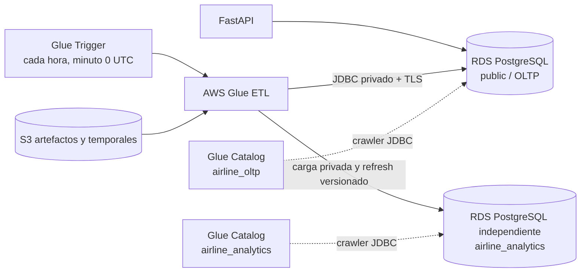

# Arquitectura de ingeniería de datos

La vista consolidada, el flujo ETL y el flujo de datos están documentados en
[Diseño detallado de la capa analítica](analytics-detailed-design.md) y en el
[catálogo de diagramas](../diagramas/README.md).

## Alcance

Esta fase prepara datos confiables para análisis posteriores. Incluye el modelo
dimensional, el proceso ETL, su operación en AWS Glue, catálogo, controles de
calidad, trazabilidad y costos. No incluye dashboards, visualizaciones,
pronósticos ni interpretación de indicadores.

La implementación desplegada usa dos instancias Amazon RDS PostgreSQL privadas:

- `airline_oltp`: sistema transaccional y fuente de verdad;
- `airline_analytics`: dimensiones, hechos y control de ejecuciones.

Ambas usan `db.t3.micro`, 20 GB gp3, Single-AZ y un día de backup para mantener
el costo bajo. El API solo recibe credenciales OLTP. El ETL abre tablas foráneas
transaccionales durante la carga y las elimina antes del commit; OLAP queda sin
tablas operacionales ni conexión persistente a OLTP.

## Flujo

El job de Glue es el orquestador. La transformación set-based vive en una
función PostgreSQL creada por Alembic, de modo que la ejecución local y Glue
usan exactamente el mismo contrato transaccional. El proceso realiza snapshot
completo y `UPSERT` para reflejar pagos, cancelaciones y reembolsos tardíos. No
se usan bookmarks JDBC basados solo en `created_at`, porque no detectarían por
sí mismos todas las actualizaciones de estado.

## Requisitos no funcionales analíticos

| ID | Condición verificable |
|---|---|
| NFR-AN-01 Frescura | Un trigger Glue activado ejecuta la carga al minuto 0 de cada hora UTC y cada corrida registra su `source_cutoff_at`. |
| NFR-AN-02 Idempotencia | Repetir el mismo `run_id` y `snapshot_at` no duplica dimensiones, ventas, reservas, puentes ni snapshots de ocupación. |
| NFR-AN-03 Reconciliación | Una ejecución exitosa deja diferencia `0.00 COP` entre pagos aprobados OLTP e ingreso aprobado OLAP, y entre refunds OLTP y refunds asignados OLAP. |
| NFR-AN-04 Consistencia | La fuente se lee con aislamiento `REPEATABLE READ` y todos los hechos de una corrida se publican en una sola transacción; un fallo no deja una carga parcial marcada como exitosa. |
| NFR-AN-05 Seguridad | RDS permanece privada, JDBC exige TLS y el schema analítico excluye nombres, apellidos, documentos, actores, agentes e idempotency keys. |
| NFR-AN-06 Auditabilidad | Cada intento conserva identificador, inicio, fin, cutoff, estado, conteos, reconciliación y error sanitizado. |
| NFR-AN-07 Aislamiento | El ETL solo lee `public`; nunca actualiza ni elimina filas OLTP. Glue permite como máximo una corrida concurrente. |
| NFR-AN-08 Escala | Si el volumen o la frecuencia crece 10 veces, se sustituye el snapshot completo por extracción incremental guiada por eventos auditables y staging/merge. |

## Decisiones AWS y trazabilidad

| Servicio o componente | Alternativa considerada | Requisito | Pilares Well-Architected y justificación |
|---|---|---|---|
| RDS OLAP `db.t3.micro` independiente | Schema compartido | FR-036, FR-038, NFR-AN-03 | **Confiabilidad** y **rendimiento**: las consultas analíticas no compiten con OLTP. **Costos**: clase mínima, Single-AZ y 20 GB. |
| AWS Glue Spark, 2 workers `G.1X` y trigger horario | Lambda, cron en EC2 | FR-036, FR-039, NFR-AN-01 | **Excelencia operativa**: servicio ETL administrado, scheduler declarativo y ejecuciones observables. **Eficiencia de rendimiento**: transformación set-based. **Costos**: el trigger se desactiva fuera de la ventana del laboratorio. |
| Glue Data Catalog y dos crawlers JDBC | Metadatos manuales | FR-040 | **Excelencia operativa** y **confiabilidad**: descubrimiento reproducible y separación lógica OLTP/OLAP. Los crawlers se ejecutan solo ante cambios de schema. |
| S3 cifrado y versionado para el job | Archivo manual en la EC2 | FR-039, NFR-AN-06 | **Confiabilidad** y **excelencia operativa**: artefacto recuperable y versionado. **Seguridad**: acceso público bloqueado y cifrado en reposo. |
| S3 Gateway Endpoint | NAT Gateway | NFR-AN-05 | **Seguridad**, **costos** y **sostenibilidad**: tráfico privado a S3 sin NAT permanente. |
| VPC, subred privada, SG autorreferenciado y TLS JDBC | RDS pública | NFR-AN-05, NFR-AN-07 | **Seguridad** y **confiabilidad**: Glue usa ENI privadas; PostgreSQL solo acepta API y Glue por grupos de seguridad. |
| `LabRole` preexistente | Rol dedicado de mínimo privilegio | Restricción ACA-02/03 | **Excelencia operativa**: única opción permitida por Learner Lab. Es una excepción de **seguridad** documentada; producción debe usar un rol dedicado. |

## Costos mensuales de referencia

Supuestos en `us-east-1`, sin créditos ni impuestos:

- 730 horas por mes;
- RDS `db.t3.micro` Single-AZ: USD 0.018/h;
- 20 GB RDS gp3: USD 0.115/GB-mes;
- Glue: USD 0.44 por DPU-hora;
- job horario de 2 DPU y 5 minutos por ejecución, 720 ejecuciones/mes;
- dos crawlers, 2 DPU, mínimo facturable asumido de 10 minutos, una vez por semana;
- menos de un millón de objetos y accesos al Data Catalog;
- 1 GB S3 Standard para scripts, versiones y temporales.

| Componente | Cálculo | Mes objetivo |
|---|---:|---:|
| RDS OLTP, cómputo | 730 × 0.018 | USD 13.14 |
| RDS OLTP, almacenamiento | 20 × 0.115 | USD 2.30 |
| RDS OLAP independiente, cómputo | 730 × 0.018 | USD 13.14 |
| RDS OLAP independiente, almacenamiento | 20 × 0.115 | USD 2.30 |
| Glue ETL horario | 720 × 2 × 5/60 × 0.44 | USD 52.80 |
| Crawlers semanales | 2 × 4.33 × 2 × 10/60 × 0.44 | USD 1.27 |
| Glue Data Catalog | Bajo free tier asumido | USD 0.00 |
| S3 | 1 GB y pocas solicitudes | ≈ USD 0.03 |
| **Total plataforma de datos** | Dos RDS y Glue horario | **≈ USD 84.98** |
| **Incremento atribuible a analítica** | RDS OLAP y Glue | **≈ USD 69.54** |

Para una ventana de demostración de cuatro horas se presupuestan cuatro
corridas programadas del job y una corrida de cada crawler. El costo
incremental estimado es aproximadamente USD 0.62, incluyendo S3 y los mínimos
de Glue, sin sumar la RDS ya desplegada. Mantener el trigger activo todo el mes
produce el escenario objetivo de USD 54.10 incrementales; debe desactivarse al
terminar la práctica si el presupuesto disponible es menor.

### Escenarios 10x

| Escenario | Supuesto conservador | Costo mensual aproximado | Respuesta de arquitectura |
|---|---|---:|---|
| Frecuencia 10x | 7,200 jobs de 5 minutos | USD 544.74 incluyendo RDS actual | No aumentar frecuencia con snapshot completo; usar eventos auditables, staging/merge y agrupar cambios. |
| Volumen 10x | El job completo pasa de 5 a 50 minutos; RDS `db.t3.small`, 200 GB | USD 578.78 | Extracción incremental, partición lógica por cutoff, índices de carga y destino RDS separado si el OLTP se degrada. |

El costo real debe recalcularse el día del despliegue. Las tarifas de Glue y
Data Catalog se documentan en [AWS Glue Pricing](https://aws.amazon.com/glue/pricing/),
y la conectividad JDBC privada sigue la guía oficial [Setting up Amazon VPC for
JDBC connections to Amazon RDS](https://docs.aws.amazon.com/glue/latest/dg/setup-vpc-for-glue-access.html).

## Evidencia de terminación

La fase de data engineering se considera terminada cuando:

1. Alembic crea `analytics` desde una base vacía y actualiza una base OLTP
   existente sin perder datos.
2. Las pruebas crean reservas pendientes, confirmadas y canceladas, ejecutan
   dos veces el ETL y verifican claves, importes, rutas y ocupación.
3. La reconciliación monetaria produce diferencia cero y distingue
   `CANCELLED`, `EXPIRED` y `PAYMENT_FAILED`.
4. CloudFormation valida sin recursos IAM, NAT, RDS pública ni JDBC sin TLS.
5. Con una sesión Learner Lab activa, el trigger horario queda `ACTIVATED`, el
   job y ambos crawlers terminan en `SUCCEEDED`, y sus tablas aparecen en los
   dos catálogos Glue.
6. Se guardan outputs sanitizados y costos de la ejecución sin credenciales ni
   PII.
