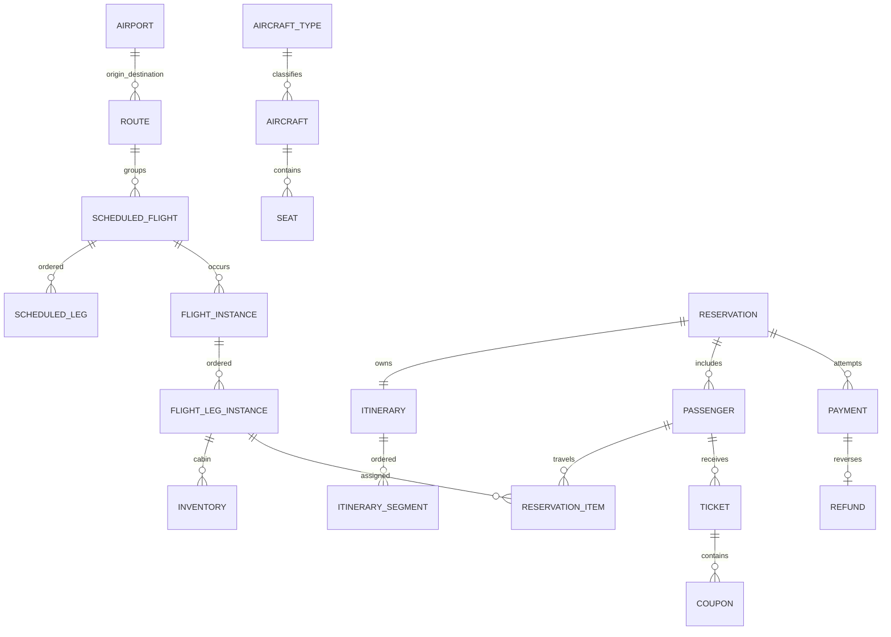

# OLTP database design

The application keeps the existing `public` schema for compatibility. Alembic is the sole DDL authority; there is no competing `schema.sql`.

Inventory is exactly one row per `flight_leg_instances × cabin`. `capacity >= held + confirmed` is a database check and booking locks inventory in canonical order. A partial unique index permits one active `(leg, seat)` assignment while released historical assignments remain; the same physical seat can therefore appear in later legs.

Commercial history uses restrictive foreign keys: reservations, payments, tickets, coupons, refunds and audit events are state transitioned rather than deleted. `reservation_items` is the immutable passenger-segment/price snapshot. `itineraries` and `itinerary_segments` give each reservation an ordered itinerary; their unique keys prevent duplicate legs or segment order. Money is `NUMERIC`, times are `timestamptz`, airport zones are IANA strings.

Critical indexes are the active seat partial unique index, inventory natural unique key, `reservation_items(reservation_id, sequence)`, payment/reservation time, and audit entity/time. Named checks constrain amounts, cabin, payment/reservation/ticket states, IATA codes and leg order. State strings are CHECKs rather than duplicated state lookup tables.

